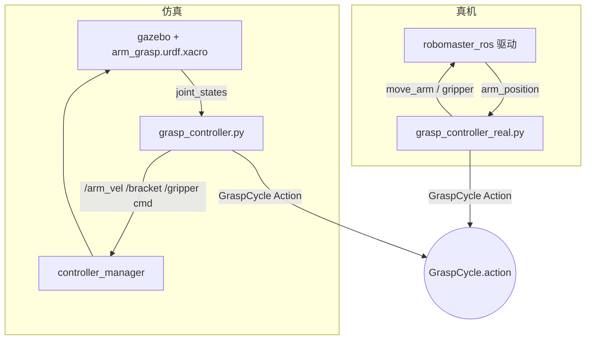
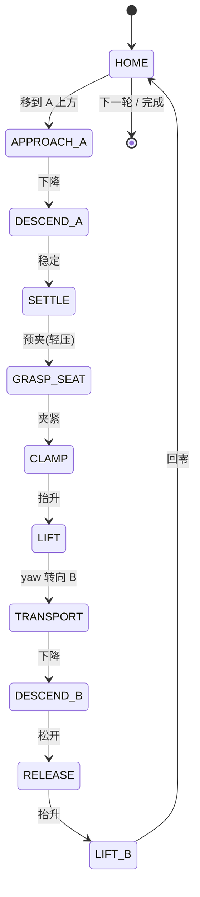

# RoboMaster EP 机械臂抓取：定点抓取 + 桌面物体分类整理（仿真 + 真机）


> 机器人集成小组项目Ⅰ · 小组实验。
>
> - **实验二 · 定点抓取**：从固定取物点 **A** 抓取目标物，搬运到固定放置区 **B** 释放，验证「给定点位 → 稳定抓取 → 搬运放置」闭环（仿真 5/5、真机 5/5）。
> - **实验三 · 桌面物体分类整理**：俯视相机识别桌面方块的颜色与位置，机械臂自动逐个抓取并按类别放入对应料盒（仿真 6/6，全自动无人工干预）。

---

## 目录

- [功能特性](#功能特性)
- [系统架构](#系统架构)
- [抓取状态机](#抓取状态机)
- [仓库结构](#仓库结构)
- [环境搭建](#环境搭建)
- [构建](#构建)
- [仿真运行（验收）](#仿真运行验收)
- [真机运行](#真机运行)
- [验收结果](#验收结果)
- [实验三扩展：桌面物体分类整理场景](#实验三扩展桌面物体分类整理场景)
- [注意事项（踩过的坑）](#注意事项踩过的坑)
- [许可证与子模块](#许可证与子模块)

---

## 功能特性

- **仿真 / 真机共用同一 Action 接口**：`GraspCycle`（`arm_grasp_interfaces`），带 `feedback`（`current_state` / `progress` / `gripper_closed`），满足"可反馈长时间任务"接口要求。
- **仿真侧**：Gazebo Classic 11 + `ros2_control` 速度跟踪 + `gazebo_grasp_fix` 真夹持力吸附（非运动学瞬移），保证搬运过程方块不脱落。
- **真机侧**：基于 `robomaster_ros` 驱动的 `move_arm` / `gripper` action，包含：
  - 工作空间安全闸门（`x_range` / `z_range` 超限直接拒绝执行）；
  - 每轮 CSV 轨迹日志（`~/grasp_logs`，含航点序列 + 10 Hz TCP 轨迹 + 每轮结果）；
  - 失败安全回收（`RECOVER_HOME`：先抬到安全高度再回位，夹着物体则回位后张爪）。
- **结果**：仿真 **5/5** 成功，真机 **5/5** 成功（视频见下）。

---

## 系统架构



- **模型**：`chassis_yaw_joint`（continuous 回转）+ `arm_1` / `arm_2`（2 自由度，带界数值 IK）+ `endpoint_bracket`（软件补偿保持爪水平）+ 平行双指夹爪（effort 接口）。
- **坐标约定**：`(yaw, d, z)`，`d` = 末端 TCP 到基座水平距离；TCP 比指尖超前 `TCP_LEAD = 0.066 m`，故抓取 `d = 物体距离 + TCP_LEAD`。

---

## 抓取状态机

单轮抓取为一串固定状态，仿真与真机共用同一骨架：



---

## 仓库结构

```
src/
  arm_grasp_interfaces/    GraspCycle action 定义（仿真/真机共用同一接口）
  arm_grasp_sim/           仿真 + 真机全部任务代码
    launch/grasp_sim.launch.py      一键启动仿真（Gazebo+控制器+抓取节点）
    urdf/arm_grasp.urdf.xacro       EP 机械臂+底盘模型（臂杆碰撞体已按基线决策移除，见下方注意事项）
    urdf/block.urdf                 目标方块（4cm 绿方块，质量 0.05kg）
    worlds/empty_grasp.world        桌面场景（update_rate=2500，RTF≈2.2）
    worlds/table_grid_4c2b.world   实验三场景：桌面 + 4 取物网格 + 2 料盒 + 俯视相机（已验证 0 error，/top_camera/image_raw ≈66Hz）
    config/controllers.yaml         ros2_control 控制器配置
    config/grasp_real.yaml          真机点位参数（A/B/安全高度，仿真→真机只改这里）
    scripts/grasp_controller.py     仿真抓取节点（GraspCycle action server）
    scripts/grasp_controller_real.py 真机抓取节点（同一 action 接口，底层走 EP 驱动 move_arm/gripper）
    scripts/grasp_interface.py      验收客户端（cycles=5，打印每轮判定）
    scripts/send_grasp_goal.py      发送抓取目标（cycles 可调）
    scripts/run_accept5.sh          仿真 5 连抓验收一条龙
    scripts/rm_offline_test.sh      真机离线联调全流程（中文引导，逐步确认）
    scripts/rm_workspace_probe.py   真机工作空间探测
    scripts/rm_arm_diag.sh          真机诊断
    scripts/patch_robomaster_sdk.sh DJI SDK 三处补丁（重装 SDK 后必须重跑）
  gazebo_grasp_plugin/     第三方抓取吸附插件（gazebo_grasp_plugin，in-tree 拷贝）
  gazebo_version_helpers/  上述插件的依赖
  robomaster_ros/          DJI EP ROS 2 驱动（git submodule: jeguzzi/robomaster_ros）
videos/                    仿真/真机 5 连抓演示视频
logs/real_machine/         真机 5 连抓 CSV 轨迹日志（state/traj/cycle 事件，全部 SUCCESS）
```

---

## 环境搭建

```bash
# ROS 2 Humble + Gazebo Classic + ros2_control 按官方文档安装后：
git clone --recurse-submodules <本仓库> && cd arm_grasp_ws
# DJI robomaster Python SDK（GitHub master）+ 依赖 + 三处补丁：
pip install numpy-quaternion av qrcode "numpy<2"
bash src/arm_grasp_sim/scripts/patch_robomaster_sdk.sh
```

> 子模块 `robomaster_ros` 是 git submodule，克隆时务必加 `--recurse-submodules`，否则真机驱动代码为空。

## 构建

```bash
source /opt/ros/humble/setup.bash
colcon build
source install/setup.bash
export GAZEBO_MODEL_PATH=$PWD/src/robomaster_ros:$GAZEBO_MODEL_PATH   # 视觉 mesh 需要
export GAZEBO_PLUGIN_PATH=$PWD/install/gazebo_grasp_plugin/lib/gazebo_grasp_plugin:$GAZEBO_PLUGIN_PATH
```

---

## 仿真运行（验收）

```bash
ros2 launch arm_grasp_sim grasp_sim.launch.py        # 一键启动
ros2 run arm_grasp_sim grasp_interface              ```

**演示视频**

<video src="videos/sim_grasp_5of5.mp4" width="480" controls></video>

---

## 真机运行

电脑连接小车热点（RoboMaster 热点，车 = `192.168.2.1`，连接后电脑断网属正常），然后：

```bash
bash src/arm_grasp_sim/scripts/rm_offline_test.sh  ```

真机点位在 `config/grasp_real.yaml`：A = 车头前缘 8cm（臂基座 x=0.20 m），B = 前缘 3cm（x=0.15 m），安全高度 0.10 m。仿真 → 真机只换设备/通信/位置参数，任务逻辑（`GraspCycle` 状态机）完全一致。

**演示视频**

<video src="videos/real_grasp_5of5.mp4" width="480" controls></video>

---

## 验收结果

| 项目 | 点位 | 结果 |
|---|---|---|
| 仿真 5 连抓 | A(0.20, 0.0) → B(0.20, 0.0) | **5/5 PASS** |
| 真机 5 连抓 | A(x=0.20) → B(x=0.15) | **5/5 PASS** |

验收阈值：`success_count >= 4/5` 即 PASS。每轮真机轨迹日志见 `logs/real_machine/`（5 个 CSV，末行均为 `CYCLE_1_OK`）。

---

## 实验三扩展：桌面物体分类整理场景

在定点抓取（实验二）基础上扩展为**自动分类整理**：机械臂不再只认固定点位，而是由俯视相机识别桌面物体、判断类别、再搬进对应料盒。

### 场景布局

```
            俯视相机 (z=1.0, 朝下)
   cell_2 ●        ● cell_3        绿盒 bin_0 (-0.095, -0.1645)
 cell_5 ●   [机械臂]   ● cell_6
   cell_1 ●        ● cell_4        黄盒 bin_1 ( 0.095, -0.1645)
```

- 6 个取物网格：`cell_1(0.19, 0)` `cell_2(0.095, 0.1645)` `cell_3(-0.095, 0.1645)`
  `cell_4(-0.19, 0)` `cell_5(0.1645, 0.095)` `cell_6(-0.1645, 0.095)`
- 6 个方块：绿 3（cell_1/3/5）+ 黄 3（cell_2/4/6），与 `GRIDS`/`CELLS` 一一对应
- 分类规则：绿 → `bin_0`，黄 → `bin_1`

### 链路（4 个节点 + 1 个 action）

| 节点 | 输入 → 输出 | 作用 |
|---|---|---|
| `vision_classifier.py` | `/top_camera/image_raw` → `/detections` | HSV 颜色分割，输出检测框与类别；`max_area` 过滤料盒等大色块 |
| `grid_mapper.py` | `/detections` → `/grid_detections` | 像素坐标经相机内参投影到桌面坐标，归入最近网格（俯视画面相对世界旋转 180°） |
| `classify_task_node.py` | `/grid_detections` → 任务状态机 | 扫描 → 计划 → 逐个下发抓取目标；处理空网格 / 未识别 / 抓取失败（重试 1 次）|
| `classify_grasp_server.py` | `ClassifyGrasp` action | 单次「抓取 → 搬运 → 放置」动作，复用实验二已验收的运动层 |

抓取序列：`HOME → APPROACH_GRID → DESCEND_GRID → GRASP → LIFT(抬至 Q_CARRY) → TRANSPORT(转 yaw 到料盒) → DESCEND_BIN → RELEASE → LIFT_BIN`。

### 一键运行

```bash
source /opt/ros/humble/setup.bash
source ~/arm_grasp_ws/install/setup.bash
ros2 launch arm_grasp_sim classify_sim.launch.py
```

全自动完成 6 个方块的识别与分类放置，无需人工干预。过程日志：`~/classify_logs/task_log.json`。

### 验收结果（2026-09-11）

```
DONE placed=6 failed=0 skipped=0
```

| 网格 | 类别 | 目标料盒 | 距盒心 | 结果 |
|---|---|---|---|---|
| cell_1 | 绿 | bin_0 | 0.057 m | ✅ |
| cell_3 | 绿 | bin_0 | 0.031 m | ✅ |
| cell_5 | 绿 | bin_0 | 0.027 m | ✅ |
| cell_2 | 黄 | bin_1 | 0.033 m | ✅ |
| cell_4 | 黄 | bin_1 | 0.027 m | ✅ |
| cell_6 | 黄 | bin_1 | 0.031 m | ✅ |

**6/6 全部正确分类**，零失败、零重试；放置判定阈值为距盒心 < 0.07 m。视觉链路单独验证同为 6/6（6 个网格的类别全部识别正确）。

---

## 注意事项（踩过的坑）

以下都是实测踩出来的，改环境或换机器时优先排查这几项。

1. **机械臂的 .dae 视觉网格会让 Gazebo 渲染线程崩溃**（WSL + llvmpipe 软渲染）。
   表现：spawn 机械臂后 `/top_camera/image_raw` 与 `/top_camera/camera_info` 直接停发（publisher 还在，帧数为 0），整个视觉链路失效。
   处理：spawn 使用去掉全部 `<visual>` 的 URDF（`scripts/make_novis_urdf.py` 生成）；`collision`、插件、控制器全部保留，物理行为不变，`robot_state_publisher` 仍用带视觉的原 xacro，RViz 中外观正常。

2. **生成 URDF 时 xacro 必须带 `config_path:=controllers.yaml`**。
   漏了这个参数，`ros2_control` 插件的 `<parameters>` 会是空的，controller_manager 起不来 → spawner 卡在 `waiting for /controller_manager/list_controllers` → 所有关节状态读成 0。

3. **`libgazebo_grasp_fix.so` 需要手动追加插件路径。**
   `gazebo_grasp_plugin` 包没有生成 `GAZEBO_PLUGIN_PATH` 的 hook，缺失时 Gazebo 只报一行 `[Err] Failed to load plugin`，**抓取会静默失败**——夹爪合上了但方块没被 attach，搬运时是被指尖在桌面上推走的。
   处理：`export GAZEBO_PLUGIN_PATH=~/arm_grasp_ws/install/gazebo_grasp_plugin/lib/gazebo_grasp_plugin:$GAZEBO_PLUGIN_PATH`（launch 里已固化）。

4. **yaw 转动不能直接套用定点抓取的参数。** 实验二验收时 A、B 是同一点，全程 yaw 不转；分类任务里抓取点与料盒方向相差最大 4.19 rad，需要按角度差自适应时长，并给足到位容差。

5. **搬运必须先把方块抬离桌面。** 贴着桌面拖行会把所有轴一起拖慢（yaw 实测从 0.62 rad/s 掉到 0.17 rad/s），导致放置全部超时失败。抬臂姿态 `Q_CARRY=(0.90, -0.30)`，TCP 高 0.11 m，方块底面悬空约 6.5 cm。

6. **WSL 里起 gzserver 需要软渲染环境变量**：`DISPLAY=:0 LIBGL_ALWAYS_SOFTWARE=1 GALLIUM_DRIVER=llvmpipe`，否则相机完全不出图。
