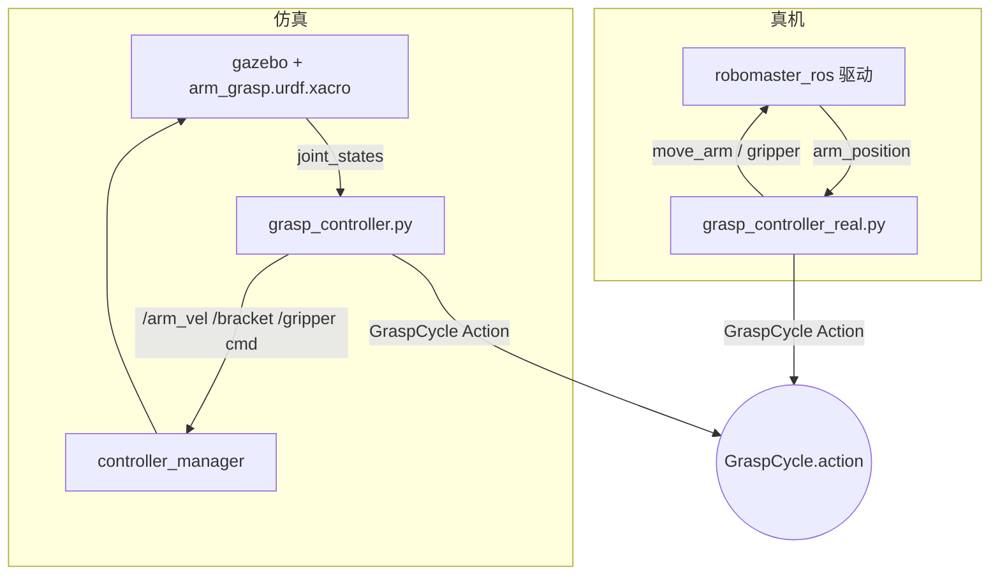
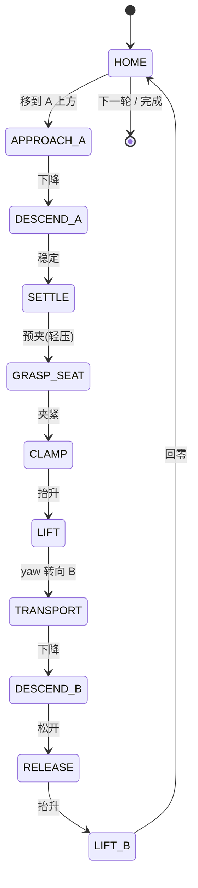

# RoboMaster EP 机械臂定点抓取（仿真 + 真机）


> 机器人集成小组项目Ⅰ · 小组实验：机械臂定点抓取。
> 从固定取物点 **A** 抓取目标物，搬运到固定放置区 **B** 释放；只验证"给定点位 → 稳定抓取 → 搬运放置"的闭环。

---

## 目录

- [功能特性](#功能特性)
- [系统架构](#系统架构)
- [抓取状态机](#抓取状态机)
- [仓库结构](#仓库结构)
- [环境搭建](#环境搭建)
- [构建](#构建)
- [仿真运行（验收）](#仿真运行验收)
- [真机运行](#真机运行)
- [验收结果](#验收结果)
- [实验三扩展：桌面物体分类整理场景](#实验三扩展桌面物体分类整理场景)
- [注意事项（踩过的坑）](#注意事项踩过的坑)
- [许可证与子模块](#许可证与子模块)

---

## 功能特性

- **仿真 / 真机共用同一 Action 接口**：`GraspCycle`（`arm_grasp_interfaces`），带 `feedback`（`current_state` / `progress` / `gripper_closed`），满足"可反馈长时间任务"接口要求。
- **仿真侧**：Gazebo Classic 11 + `ros2_control` 速度跟踪 + `gazebo_grasp_fix` 真夹持力吸附（非运动学瞬移），保证搬运过程方块不脱落。
- **真机侧**：基于 `robomaster_ros` 驱动的 `move_arm` / `gripper` action，包含：
  - 工作空间安全闸门（`x_range` / `z_range` 超限直接拒绝执行）；
  - 每轮 CSV 轨迹日志（`~/grasp_logs`，含航点序列 + 10 Hz TCP 轨迹 + 每轮结果）；
  - 失败安全回收（`RECOVER_HOME`：先抬到安全高度再回位，夹着物体则回位后张爪）。
- **结果**：仿真 **5/5** 成功，真机 **5/5** 成功（视频见下）。

---

## 系统架构



- **模型**：`chassis_yaw_joint`（continuous 回转）+ `arm_1` / `arm_2`（2 自由度，带界数值 IK）+ `endpoint_bracket`（软件补偿保持爪水平）+ 平行双指夹爪（effort 接口）。
- **坐标约定**：`(yaw, d, z)`，`d` = 末端 TCP 到基座水平距离；TCP 比指尖超前 `TCP_LEAD = 0.066 m`，故抓取 `d = 物体距离 + TCP_LEAD`。

---

## 抓取状态机

单轮抓取为一串固定状态，仿真与真机共用同一骨架：



---

## 仓库结构

```
src/
  arm_grasp_interfaces/    GraspCycle action 定义（仿真/真机共用同一接口）
  arm_grasp_sim/           仿真 + 真机全部任务代码
    launch/grasp_sim.launch.py      一键启动仿真（Gazebo+控制器+抓取节点）
    urdf/arm_grasp.urdf.xacro       EP 机械臂+底盘模型（臂杆碰撞体已按基线决策移除，见下方注意事项）
    urdf/block.urdf                 目标方块（4cm 绿方块，质量 0.05kg）
    worlds/empty_grasp.world        桌面场景（update_rate=2500，RTF≈2.2）
    worlds/table_grid_4c2b.world   实验三场景：桌面 + 4 取物网格 + 2 料盒 + 俯视相机（已验证 0 error，/top_camera/image_raw ≈66Hz）
    config/controllers.yaml         ros2_control 控制器配置
    config/grasp_real.yaml          真机点位参数（A/B/安全高度，仿真→真机只改这里）
    scripts/grasp_controller.py     仿真抓取节点（GraspCycle action server）
    scripts/grasp_controller_real.py 真机抓取节点（同一 action 接口，底层走 EP 驱动 move_arm/gripper）
    scripts/grasp_interface.py      验收客户端（cycles=5，打印每轮判定）
    scripts/send_grasp_goal.py      发送抓取目标（cycles 可调）
    scripts/run_accept5.sh          仿真 5 连抓验收一条龙
    scripts/rm_offline_test.sh      真机离线联调全流程（中文引导，逐步确认）
    scripts/rm_workspace_probe.py   真机工作空间探测
    scripts/rm_arm_diag.sh          真机诊断
    scripts/patch_robomaster_sdk.sh DJI SDK 三处补丁（重装 SDK 后必须重跑）
  gazebo_grasp_plugin/     第三方抓取吸附插件（gazebo_grasp_plugin，in-tree 拷贝）
  gazebo_version_helpers/  上述插件的依赖
  robomaster_ros/          DJI EP ROS 2 驱动（git submodule: jeguzzi/robomaster_ros）
videos/                    仿真/真机 5 连抓演示视频
logs/real_machine/         真机 5 连抓 CSV 轨迹日志（state/traj/cycle 事件，全部 SUCCESS）
```

---

## 环境搭建

```bash
# ROS 2 Humble + Gazebo Classic + ros2_control 按官方文档安装后：
git clone --recurse-submodules <本仓库> && cd arm_grasp_ws
# DJI robomaster Python SDK（GitHub master）+ 依赖 + 三处补丁：
pip install numpy-quaternion av qrcode "numpy<2"
bash src/arm_grasp_sim/scripts/patch_robomaster_sdk.sh
```

> 子模块 `robomaster_ros` 是 git submodule，克隆时务必加 `--recurse-submodules`，否则真机驱动代码为空。

## 构建

```bash
source /opt/ros/humble/setup.bash
colcon build
source install/setup.bash
export GAZEBO_MODEL_PATH=$PWD/src/robomaster_ros:$GAZEBO_MODEL_PATH   # 视觉 mesh 需要
export GAZEBO_PLUGIN_PATH=$PWD/install/gazebo_grasp_plugin/lib/gazebo_grasp_plugin:$GAZEBO_PLUGIN_PATH
```

---

## 仿真运行（验收）

```bash
ros2 launch arm_grasp_sim grasp_sim.launch.py        # 一键启动完整系统
ros2 run arm_grasp_sim grasp_interface               # 另开终端：5 连抓验收，>=4/5 通过
# 或一条龙：bash src/arm_grasp_sim/scripts/run_accept5.sh
```

**演示视频**

<video src="videos/sim_grasp_5of5.mp4" width="480" controls></video>

---

## 真机运行

电脑连接小车热点（RoboMaster 热点，车 = `192.168.2.1`，连接后电脑断网属正常），然后：

```bash
bash src/arm_grasp_sim/scripts/rm_offline_test.sh    # 中文引导：连车→夹爪→臂动作→单抓→5 连抓
```

真机点位在 `config/grasp_real.yaml`：A = 车头前缘 8cm（臂基座 x=0.20 m），B = 前缘 3cm（x=0.15 m），安全高度 0.10 m。仿真 → 真机只换设备/通信/位置参数，任务逻辑（`GraspCycle` 状态机）完全一致。

**演示视频**

<video src="videos/real_grasp_5of5.mp4" width="480" controls></video>

---

## 验收结果

| 项目 | 点位 | 结果 |
|---|---|---|
| 仿真 5 连抓 | A(0.20,0.0) → B(0.20,0.0) | **5/5 成功**（判据：方块落点离 B < 6 cm 且高度对） |
| 真机 5 连抓 | A(x=0.20) → B(x=0.15) | **5/5 成功**（判据：所有航点 + 爪动作 result 成功 + LIFT 抬升确认） |

验收阈值：`success_count >= 4/5` 即 PASS。每轮真机轨迹日志见 `logs/real_machine/`。

---


