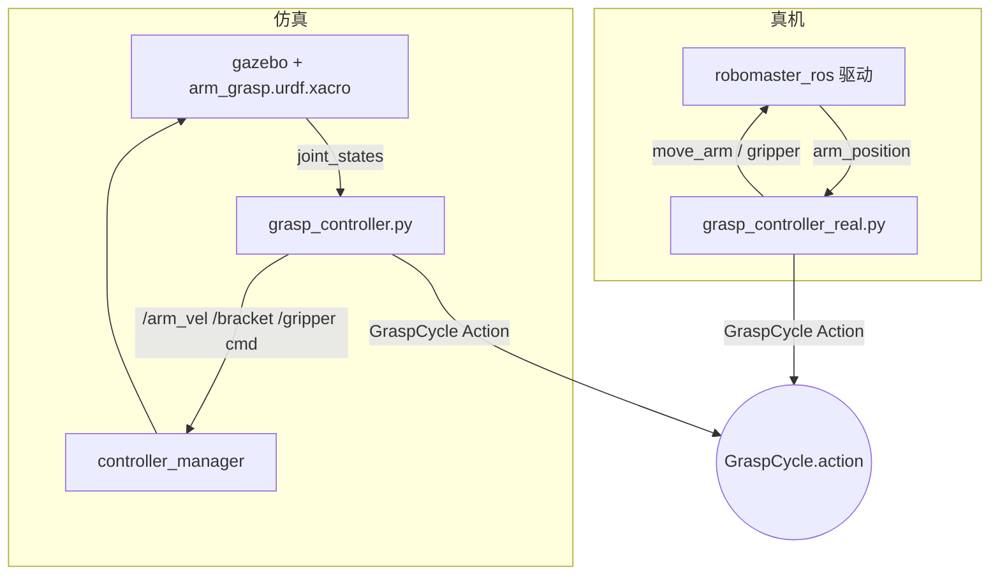
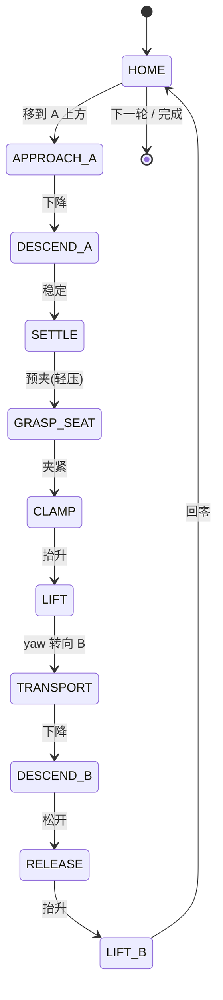

# RoboMaster EP 机械臂抓取：定点抓取 + 桌面物体分类整理（仿真 + 真机）


> 机器人集成小组项目Ⅰ · 小组实验。
>
> - **实验二 · 定点抓取**：从固定取物点 **A** 抓取目标物，搬运到固定放置区 **B** 释放，验证「给定点位 → 稳定抓取 → 搬运放置」闭环（仿真 5/5、真机 5/5）。
> - **实验三 · 桌面物体分类整理**：俯视相机识别桌面方块的颜色与位置，机械臂自动逐个抓取并按类别放入对应料盒（仿真 6/6，全自动无人工干预）。

---

## 目录

- [功能特性](#功能特性)
- [系统架构](#系统架构)
- [抓取状态机](#抓取状态机)
- [仓库结构](#仓库结构)
- [环境搭建](#环境搭建)
- [构建](#构建)
- [仿真运行（验收）](#仿真运行验收)
- [真机运行](#真机运行)
- [验收结果](#验收结果)
- [实验三扩展：桌面物体分类整理场景](#实验三扩展桌面物体分类整理场景)
- [注意事项（踩过的坑）](#注意事项踩过的坑)
- [许可证与子模块](#许可证与子模块)

---

## 功能特性

- **仿真 / 真机共用同一 Action 接口**：`GraspCycle`（`arm_grasp_interfaces`），带 `feedback`（`current_state` / `progress` / `gripper_closed`），满足"可反馈长时间任务"接口要求。
- **仿真侧**：Gazebo Classic 11 + `ros2_control` 速度跟踪；夹持保留靠**摩擦物理**（非运动学瞬移，物体位置全程由 Gazebo 解算）。
  `gazebo_grasp_fix` 插件确已构建并随 launch 加入 `GAZEBO_PLUGIN_PATH`、日志无加载失败，但**实测它并未对本场景的物体生效**（物体可相对 TCP 自由移动/上滑，说明没有被 attach），所以不要把"物体不掉落"归因于该插件；真正的保持来自指面-物体摩擦。
- **真机侧**：基于 `robomaster_ros` 驱动的 `move_arm` / `gripper` action，包含：
  - 工作空间安全闸门（`x_range` / `z_range` 超限直接拒绝执行）；
  - 每轮 CSV 轨迹日志（`~/grasp_logs`，含航点序列 + 10 Hz TCP 轨迹 + 每轮结果）；
  - 失败安全回收（`RECOVER_HOME`：先抬到安全高度再回位，夹着物体则回位后张爪）。
- **结果**：仿真 **5/5** 成功，真机 **5/5** 成功（视频见下）。

---

## 系统架构



- **模型**：`chassis_yaw_joint`（continuous 回转）+ `arm_1` / `arm_2`（2 自由度，带界数值 IK）+ `endpoint_bracket`（软件补偿保持爪水平）+ 平行双指夹爪（effort 接口）。
- **坐标约定**：`(yaw, d, z)`，`d` = 末端 TCP 到基座水平距离；TCP 比指尖超前 `TCP_LEAD = 0.066 m`，故抓取 `d = 物体距离 + TCP_LEAD`。

---

## 抓取状态机

单轮抓取为一串固定状态，仿真与真机共用同一骨架：



---

## 仓库结构

```
src/
  arm_grasp_interfaces/    GraspCycle action 定义（仿真/真机共用同一接口）
  arm_grasp_sim/           仿真 + 真机全部任务代码
    launch/grasp_sim.launch.py      一键启动仿真（Gazebo+控制器+抓取节点）
    urdf/arm_grasp.urdf.xacro       EP 机械臂+底盘模型（臂杆碰撞体已按基线决策移除，见下方注意事项）
    urdf/block.urdf                 目标方块（4cm，绿/黄两类，质量 0.05kg）；各色 URDF：block.urdf(绿) / block_yellow.urdf(黄) / block_red.urdf(仅异常注入用)
    worlds/empty_grasp.world        桌面场景（update_rate=2500，RTF≈2.2）
    worlds/table_grid_4c2b.world   实验三场景：桌面 + 6 取物网格 + 2 料盒（中性灰，避免与同色方块合并）+ 俯视相机（已验证 0 error，/top_camera/image_raw ≈66Hz）
    config/controllers.yaml         ros2_control 控制器配置
    config/grasp_real.yaml          真机点位参数（A/B/安全高度，仿真→真机只改这里）
    config/classify_real.yaml       真机上机标定项（网格/料盒方位角、固定点位、相机参数）
    launch/classify_sim.launch.py   实验三一键启动（含 blocks_preset 异常注入场景）
    launch/classify_real.launch.py  实验三真机一键启动
    scripts/vision_classifier.py    视觉识别节点（轮廓法/YOLO → /detections Detection2DArray）
    scripts/grid_mapper.py          检测框 → 网格号（→ /grid_detections）
    scripts/classify_task_node.py   分类任务状态机（扫描/抓取/异常处理/日志）
    scripts/classify_grasp_server.py 仿真 ClassifyGrasp action server
    scripts/classify_grasp_server_real.py 真机 ClassifyGrasp action server（同契约）
    scripts/run_exceptions.sh       异常场景验收批跑（空网格/未识别/不可达/抓取失败）
    scripts/grasp_controller.py     仿真抓取节点（GraspCycle action server）
    scripts/grasp_controller_real.py 真机抓取节点（同一 action 接口，底层走 EP 驱动 move_arm/gripper）
    scripts/grasp_interface.py      验收客户端（cycles=5，打印每轮判定）
    scripts/send_grasp_goal.py      发送抓取目标（cycles 可调）
    scripts/run_accept5.sh          仿真 5 连抓验收一条龙
    scripts/rm_offline_test.sh      真机离线联调全流程（中文引导，逐步确认）
    scripts/rm_workspace_probe.py   真机工作空间探测
    scripts/rm_arm_diag.sh          真机诊断
    scripts/patch_robomaster_sdk.sh DJI SDK 三处补丁（重装 SDK 后必须重跑）
  gazebo_grasp_plugin/     第三方抓取吸附插件（gazebo_grasp_plugin，in-tree 拷贝）
  gazebo_version_helpers/  上述插件的依赖
  robomaster_ros/          DJI EP ROS 2 驱动（git submodule: jeguzzi/robomaster_ros）
videos/                    仿真/真机 5 连抓演示视频
logs/real_machine/         真机 5 连抓 CSV 轨迹日志（state/traj/cycle 事件，全部 SUCCESS）
```

---

## 环境搭建

```bash
# ROS 2 Humble + Gazebo Classic + ros2_control 按官方文档安装后：
git clone --recurse-submodules <本仓库> && cd arm_grasp_ws
# DJI robomaster Python SDK（GitHub master）+ 依赖 + 三处补丁：
pip install numpy-quaternion av qrcode "numpy<2"
bash src/arm_grasp_sim/scripts/patch_robomaster_sdk.sh
```

> 子模块 `robomaster_ros` 是 git submodule，克隆时务必加 `--recurse-submodules`，否则真机驱动代码为空。

## 构建

```bash
source /opt/ros/humble/setup.bash
colcon build
source install/setup.bash
export GAZEBO_MODEL_PATH=$PWD/src/robomaster_ros:$GAZEBO_MODEL_PATH   # 视觉 mesh 需要
export GAZEBO_PLUGIN_PATH=$PWD/install/gazebo_grasp_plugin/lib/gazebo_grasp_plugin:$GAZEBO_PLUGIN_PATH
```

---

## 仿真运行（验收）

```bash
ros2 launch arm_grasp_sim grasp_sim.launch.py        # 一键启动
ros2 run arm_grasp_sim grasp_interface              ```

**演示视频**

<video src="videos/sim_grasp_5of5.mp4" width="480" controls></video>

---

## 真机运行

电脑连接小车热点（RoboMaster 热点，车 = `192.168.2.1`，连接后电脑断网属正常），然后：

```bash
bash src/arm_grasp_sim/scripts/rm_offline_test.sh  ```

真机点位在 `config/grasp_real.yaml`：A = 车头前缘 8cm（臂基座 x=0.20 m），B = 前缘 3cm（x=0.15 m），安全高度 0.10 m。仿真 → 真机只换设备/通信/位置参数，任务逻辑（`GraspCycle` 状态机）完全一致。

**演示视频**

<video src="videos/real_grasp_5of5.mp4" width="480" controls></video>

### 真机运行（实验三 · 分类整理）

真机链路与仿真**共用同一 `ClassifyGrasp` action 与任务状态机**，只换底层运动与感知源：

```bash
# 连接小车热点后，一个 launch 起全链路（默认同时启动 robomaster_ros 驱动）
ros2 launch arm_grasp_sim classify_real.launch.py conn_type:=ap
# 驱动已在别处启动时：  ... with_driver:=false
```

| 文件 | 作用 |
|---|---|
| `scripts/classify_grasp_server_real.py`（新） | 真机分类抓取 server：底盘转方位 + `move_arm`(x,z) + `gripper` |
| `launch/classify_real.launch.py`（新） | 一个 launch 起 驱动 + 视觉 + 映射 + 任务 + 真机 server |
| `config/classify_real.yaml`（新） | 上机标定参数（网格/料盒方位、固定 x/z 点位、相机、YOLO 权重） |
| `vision_classifier.py` / `grid_mapper.py` / `classify_task_node.py` | 复用（视觉设 `use_yolo:=true` 走实验一模型） |

**上机前必须标定**（都在 `config/classify_real.yaml`）：
1. `grid_azimuth` / `bin_azimuth`：各网格/料盒相对机器人初始朝向的方位角（rad）。
2. `x_grasp / z_grasp / x_drop / z_drop`：固定抓取/投放点位（EP 实测可达 x∈[0.05,0.24]，>0.20 饱和）。
3. `vision_classifier.image_topic` 与 `yolo_weights`：真机相机话题 + 实验一模型。
4. `grid_mapper` 的 `image_width/height/hfov/cam_height/swap_axes`：相机标定；网格中心 `CELLS` 若与真机桌面不同需同步改代码。
5. `confirm_via_detect`：抓取确认依赖 `/grid_detections`，先确认抬臂后相机不被遮挡，再决定是否开 `miss_if_still_present`。

> 真机 EP 臂**没有 yaw**，靠**转底盘**把目标网格/料盒转到臂正前方（`use_chassis`）。
> 若物体都摆在臂正前方一条带内，可设 `use_chassis:=false` 只做单平面抓取。

---

## 验收结果

| 项目 | 点位 | 结果 |
|---|---|---|
| 仿真 5 连抓 | A(0.20, 0.0) → B(0.20, 0.0) | **5/5 PASS** |
| 真机 5 连抓 | A(x=0.20) → B(x=0.15) | **5/5 PASS** |

验收阈值：`success_count >= 4/5` 即 PASS。每轮真机轨迹日志见 `logs/real_machine/`（5 个 CSV，末行均为 `CYCLE_1_OK`）。

---

## 实验三扩展：桌面物体分类整理场景

在定点抓取（实验二）基础上扩展为**自动分类整理**：机械臂不再只认固定点位，而是由俯视相机识别桌面物体、判断类别、再搬进对应料盒。

### 场景布局

```
            俯视相机 (z=1.0, 朝下)
         cell_3 ●  ● cell_2
      cell_4 ●  [机械臂]  ● cell_1        bin_1 (-0.0770, -0.2114)
         cell_5 ●  ● cell_6                bin_0 (-0.1949, -0.1125)
```

- 6 个取物网格（呈 20°~160° 弧形排列）：`cell_1(0.1785, 0.0650)` `cell_2(0.1271, 0.1412)`
  `cell_3(0.0460, 0.1844)` `cell_4(-0.0460, 0.1844)` `cell_5(-0.1271, 0.1412)` `cell_6(-0.1785, 0.0650)`
- 6 个方块：**绿 3 / 黄 3**（cell_1 / cell_3 / cell_6 绿，cell_2 / cell_4 / cell_5 黄），与 `GRIDS`/`CELLS` 一一对应
- 2 个料盒（中性灰，仅作放置位；类别由代码 `class_bin_map` 映射，与视觉无关）：绿 → `bin_0`、黄 → `bin_1`

### 链路（4 个节点 + 1 个 action）

| 节点 | 输入 → 输出 | 作用 |
|---|---|---|
| `vision_classifier.py` | `/top_camera/image_raw` → `/detections` | 方案 C：轮廓法检测框 + 框内 HSV 颜色直方图分类（**绿/黄两类**）；料盒设中性灰被 is_colored 掩码排除，不与同色方块合并 |
| `grid_mapper.py` | `/detections` → `/grid_detections` | 像素坐标经相机内参投影到桌面坐标，归入最近网格（俯视画面相对世界旋转 180°） |
| `classify_task_node.py` | `/grid_detections` → 任务状态机 | 扫描 → 计划 → 逐个下发抓取目标；处理空网格 / 未识别 / 抓取失败（重试 1 次）|
| `classify_grasp_server.py` | `ClassifyGrasp` action | 单次「抓取 → 搬运 → 放置」动作，复用实验二已验收的运动层 |

抓取序列：`HOME → APPROACH_GRID → DESCEND_GRID → GRASP → LIFT(抬至 Q_CARRY) → TRANSPORT(转 yaw 到料盒) → DESCEND_BIN → RELEASE → LIFT_BIN`。

### 一键运行

```bash
source /opt/ros/humble/setup.bash
source ~/arm_grasp_ws/install/setup.bash
export DISPLAY=:0 LIBGL_ALWAYS_SOFTWARE=1 GALLIUM_DRIVER=llvmpipe   # WSL 软渲染：相机出图必须
ros2 launch arm_grasp_sim classify_sim.launch.py
```

全自动完成 6 个方块的识别与分类放置，无需人工干预。过程日志：`~/classify_logs/task_log.json`。

### 验收结果（2026-09-14，`ros2 launch arm_grasp_sim classify_sim.launch.py` 全自动验收）

```
DONE placed=6 failed=0 skipped=0     # 两类 6 块全部正确分类
```

| 网格 | 类别 | 目标料盒 | 距盒心 | 结果 |
|---|---|---|---|---|
| cell_1 | 绿 | bin_0 | 0.022 m | ✅ |
| cell_2 | 黄 | bin_1 | 0.023 m | ✅ |
| cell_3 | 绿 | bin_0 | 0.024 m | ✅ |
| cell_4 | 黄 | bin_1 | 0.026 m | ✅ |
| cell_5 | 黄 | bin_1 | 0.032 m | ✅ |
| cell_6 | 绿 | bin_0 | 0.020 m | ✅ |

**6/6 全部正确分类**，零失败、零重试；放置判定阈值为距盒心 < 0.07 m。两类各归其盒：绿 → `bin_0`（3 块）、黄 → `bin_1`（3 块）。视觉链路扫描阶段 6 个网格类别全部识别正确。

### 异常场景验收（2026-09-15）

实验要求「**至少正确处理空网格和未识别物体两种情况**」→ 该两项为**核心必测项（★）**，各**连续两次复现一致**；另附加覆盖 2 类异常。
异常通过 `blocks_preset` / `z_grasp` 参数注入，**不改动运行期代码**；全自动、无人工干预。

| 场景 | 注入方式 | 期望 | 实测（连续两次） | 判定 |
|---|---|---|---|---|
| ★ 空网格 | `empty_grid`（只放 4 块，cell_5/6 空） | 2 skipped_empty + 4 placed | placed=4 / skipped_empty=2 / failed=0 ×2 一致 | ✅ |
| ★ 未识别物体 | `unknown_obj`（cell_4 换红块） | 1 skipped_unknown + 5 placed | placed=5 / skipped_unknown=1 / failed=0 ×2 一致 | ✅ |
| 抓取失败 | `miss_grasp`（cell_1 外偏 0.055 m → 夹空） | 1 grasp_failed + 1 placed（不中断） | placed=1 / grasp_failed=1 | ✅ |
| IK 不可达 | `unreachable z_grasp:=0.005` | 2 unreachable（不重试） | unreachable=2 | ✅ |
| 正常回归 | 默认 `normal` | 6/6 | placed=6 / failed=0 / skipped=0 | ✅ |

- 异常后任务**不中断**：S3 夹空后 cell_2 照常放置；S1/S2/S4 均跑完并输出 summary。
- 失败分类：夹空（error_code=2）重试 1 次后记 `grasp_failed`；IK 不可达（error_code=1）确定性失败**不重试**。
- 全量记录：`~/classify_logs/exceptions/<场景>/task_log.json`，汇总 `_summary.txt`；方法与逐条证据见 [`docs/实验三_异常测试记录.md`](src/arm_grasp_sim/docs/实验三_异常测试记录.md)。
- ⚠️ 已知偶发：cell_4 位于可达包络边缘，曾出现 1 次 `motion_failed`（关节未收敛），复跑即恢复。已在记录文档 §6 诚实标注。

---

## 注意事项（踩过的坑）

以下都是实测踩出来的，改环境或换机器时优先排查这几项。

1. **机械臂的 .dae 视觉网格会让 Gazebo 渲染线程崩溃**（WSL + llvmpipe 软渲染）。
   表现：spawn 机械臂后 `/top_camera/image_raw` 与 `/top_camera/camera_info` 直接停发（publisher 还在，帧数为 0），整个视觉链路失效。
   处理：spawn 使用去掉全部 `<visual>` 的 URDF（`scripts/make_novis_urdf.py` 生成）；`collision`、插件、控制器全部保留，物理行为不变，`robot_state_publisher` 仍用带视觉的原 xacro，RViz 中外观正常。

2. **生成 URDF 时 xacro 必须带 `config_path:=controllers.yaml`**。
   漏了这个参数，`ros2_control` 插件的 `<parameters>` 会是空的，controller_manager 起不来 → spawner 卡在 `waiting for /controller_manager/list_controllers` → 所有关节状态读成 0。

3. **`libgazebo_grasp_fix.so` 需要手动追加插件路径。**
   `gazebo_grasp_plugin` 包没有生成 `GAZEBO_PLUGIN_PATH` 的 hook，缺失时 Gazebo 只报一行 `[Err] Failed to load plugin`，**抓取会静默失败**——夹爪合上了但方块没被 attach，搬运时是被指尖在桌面上推走的。
   处理：`export GAZEBO_PLUGIN_PATH=~/arm_grasp_ws/install/gazebo_grasp_plugin/lib/gazebo_grasp_plugin:$GAZEBO_PLUGIN_PATH`（launch 里已固化）。

4. **yaw 转动不能直接套用定点抓取的参数。** 实验二验收时 A、B 是同一点，全程 yaw 不转；分类任务里抓取点与料盒方向相差最大 4.19 rad，需要按角度差自适应时长，并给足到位容差。

5. **搬运必须先把方块抬离桌面。** 贴着桌面拖行会把所有轴一起拖慢（yaw 实测从 0.62 rad/s 掉到 0.17 rad/s），导致放置全部超时失败。抬臂姿态 `Q_CARRY=(0.90, -0.30)`，TCP 高 0.11 m，方块底面悬空约 6.5 cm。

6. **WSL 里起 gzserver 需要软渲染环境变量**：`DISPLAY=:0 LIBGL_ALWAYS_SOFTWARE=1 GALLIUM_DRIVER=llvmpipe`，否则相机完全不出图。

7. **实验三料盒用中性灰、类别靠代码映射。** 早期用「同色料盒」做视觉提示，但俯视图像里同色方块会与同色料盒轮廓连成超大轮廓被 `max_area` 过滤，导致该色方块漏检（蓝块曾因此丢失）。改为料盒全设中性灰（S≈0，不进 `is_colored` 掩码），方块→料盒的映射完全由 `classify_task_node` 的 `class_bin_map` 决定，与视觉无关，两类全部稳定检出。

8. **抓取顺序必须确定性且 cell_1 优先。** cell_1 与 cell_2 相邻（中心距约 9 cm），若 cell_1 排最后处理，前序抓取/搬运会把 block_0 蹭飞 8~17 cm，导致夹空失败（曾长期卡在 5/6）。改为 `classify_task_node._plan` 按 cell 编号升序排队，block_0 在被触碰前即被抓走；同时 `classify_grasp_server` 把回程（LIFT_BIN 后）空夹爪先升到高位再转 yaw、接近段 `APPROACH_Z` 抬到 0.14，避免空夹爪在低高度旋转扫到桌面方块。两项叠加后稳定 6/6（连续两次复现）。
